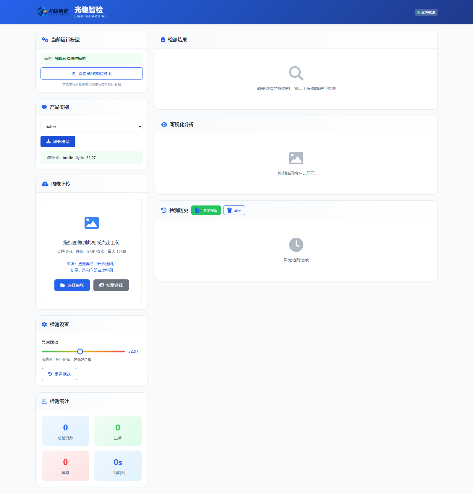
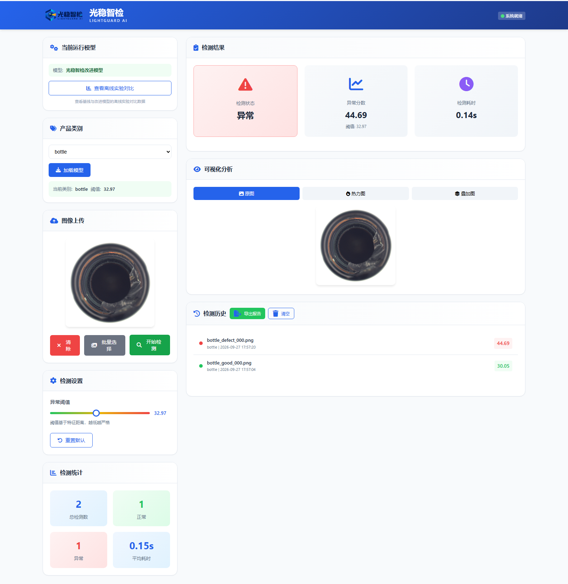
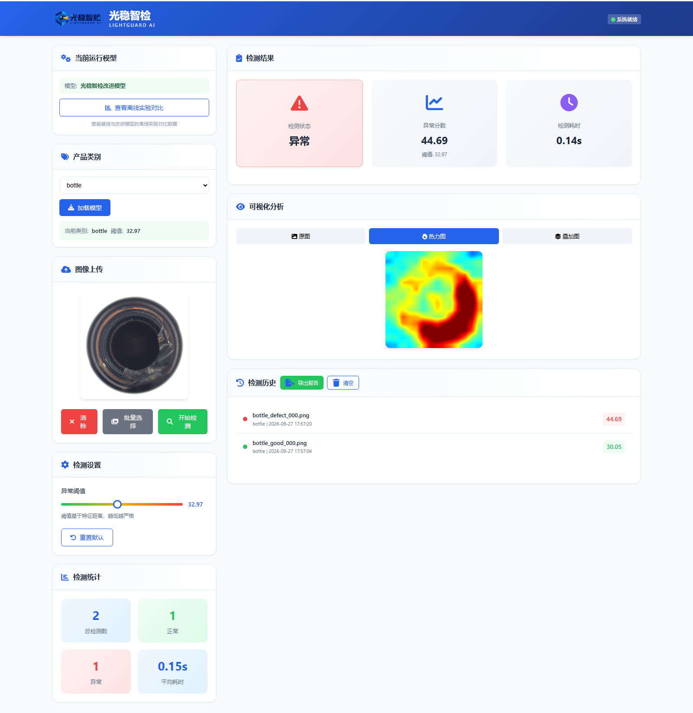
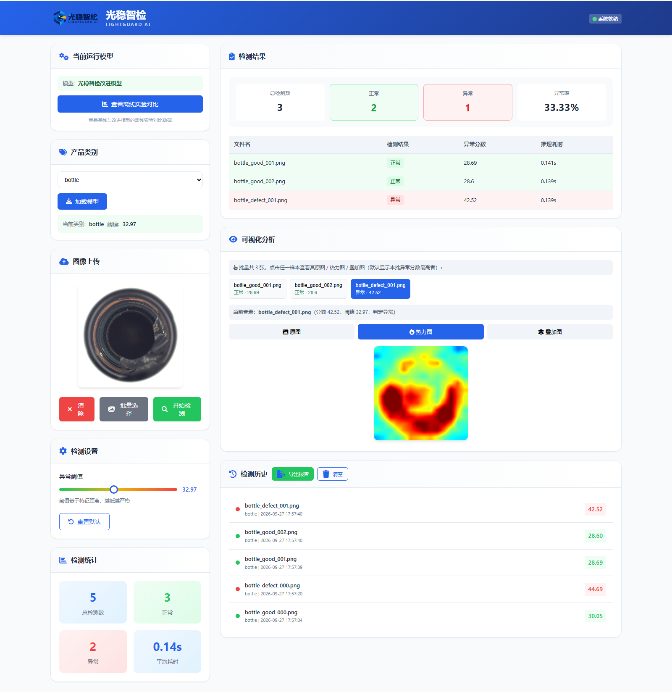

# 光稳智检 LIGHTGUARD AI

**面向复杂光照环境的工业视觉异常检测与缺陷定位平台**

iCAN 大学生创新创业大赛 · AI应用创新挑战赛 · 高校组 · 软件赛道

---

## 本仓库包含两部分

| 部分 | 内容 | 用途 |
|---|---|---|
| **项目展示站**（仓库根目录） | `index.html`、`styles.css`、`script.js`、`assets/` | 已通过 GitHub Pages 发布，用于在线查看项目介绍与真实截图 |
| **可运行程序源代码** | `01_可运行系统/`、`原始实验记录/`、技术文档与应用方案书 | 满足赛事"提供应用程序源代码"的要求，可下载后本地运行 |

**在线展示站**：<https://shy10086332.github.io/lightguard-ai/>

> 展示站是静态页面，无法运行后端。真正的检测程序使用 Flask + PyTorch 与本地模型权重，
> 需按下方"快速开始"在本地运行；**模型权重体积超出 GitHub 单文件限制，放在本仓库的 Releases 中**。

---

## 这是什么

一套可在 Windows 本地离线运行的工业视觉质检原型系统。上传产品图片，系统输出**正常/异常判定**、**异常分数**、**所属类别阈值**，以及**像素级异常热力图与原图叠加图**；支持批量检测、逐张查看、检测历史与 CSV 报告导出。

技术路线以 PatchCore 为基础，研究**光照扰动下的记忆库构建与评测**。仅需**正常样本**即可建库，不需要缺陷样本。

---

## 快速开始

```bash
# 1. 克隆仓库
git clone https://github.com/SHY10086332/lightguard-ai.git
cd lightguard-ai

# 2. 从本仓库 Releases 下载权重包 lightguard-weights.zip，
#    解压后把 pretrained/ 与 weights/ 两个目录放入 01_可运行系统/
#    详见 01_可运行系统/weights/README_权重获取说明.md

# 3. 安装依赖（首次需要联网，之后可完全离线运行）
cd 01_可运行系统
pip install -r requirements.txt

# 4. 启动
python app.py
```

浏览器打开 <http://127.0.0.1:5000>，按"选择类别 → 加载模型 → 上传图片 → 开始检测"操作。

Windows 下也可直接双击 **`01_可运行系统/光稳智检_iCAN演示启动.bat`**，脚本会自动检查 Python 与依赖。

**环境要求**：Windows 10/11，Python 3.10 – 3.13（已在 3.11.9 与 3.13.9 实测），CPU 即可运行，常驻内存约 1.1 GB。全部依赖见 `01_可运行系统/requirements.txt`。

**离线可用性**：骨干权重与 15 类记忆库随包提供，界面图标字体亦已本地内置，**全部功能不依赖任何外部网络**（已验证：屏蔽所有外部请求后图标与检测功能均正常）。

---

## 系统截图

| 类别加载与阈值 | 缺陷检测与判定 |
|---|---|
|  |  |

| 异常热力图 | 批量检测（可逐张切换） |
|---|---|
|  |  |

---

## 实测性能（MVTec AD，15 类，改进模型）

> 以下数字均可由 `原始实验记录/` 中的结果 JSON 追溯，并已用本仓库代码在官方测试集上独立复算（15 类宏平均复算 **88.14%** vs 记录 **88.13%**）。

| 指标 | 数值 |
|---|---|
| 平均 Image AUROC | 88.13% |
| 平均 Pixel AUROC | 92.43% |
| 平均 AUPRO | 73.72% |
| 平均 F1（**阈值取优最优值，非固定阈值下的 F1**） | 91.21% |
| Image AUROC 类别区间 | 50.38%（screw）～ 100%（leather），15 类中 12 类 ≥ 84% |
| **正常图误报率（类别均值）** | **34.27%** |
| **缺陷召回率（类别均值）** | **93.49%** |

**误报率与召回率必须成对阅读。** 本系统定位为**批量预筛 + 人工复核**，该场景下漏检代价高于误报，因此采用**高召回工作点**：34.27% 的误报率换来 93.49% 的召回率。若改按目标误报率 5% 重标阈值，误报率可降至约 9.6%，但召回率同期降至约 70.7%（约 23 个百分点的缺陷被漏检）。

### 基线与改进的配对对比（同轮 6 类）

| 类别 | 基线 Image AUROC | 改进 Image AUROC | 变化 |
|---|---:|---:|---:|
| bottle | 94.52% | 98.41% | +3.89 pp |
| cable | 92.05% | 82.40% | −9.65 pp |
| capsule | 90.47% | 83.25% | −7.22 pp |
| carpet | 99.92% | 99.12% | −0.80 pp |
| grid | 88.81% | 78.78% | −10.03 pp |
| hazelnut | 99.57% | 99.79% | +0.21 pp |
| **平均** | **94.22%** | **90.29%** | **−3.93 pp** |

六类中 2 类提升、4 类下降，**平均低于基线**。我们不把局部提升表述为整体更优。变化值由未舍入的原始 AUROC 相减后保留两位小数（hazelnut 实际为 +0.214 pp）。

### 光照域偏移评测（MVTec AD 2，8 类，本地记录）

Image AUROC 宏平均 58.96% → 62.07%（**+3.11 pp**），5 类提高、3 类下降；但同一轮**像素级指标全部略降**：Pixel AUROC 80.18% → 78.24%（−1.94 pp）、AUPRO 37.66% → 37.35%（−0.31 pp）、Pixel AP 11.64% → 8.57%（−3.07 pp）、Pixel F1（阈值取优）17.37% → 13.12%（−4.26 pp），且正常图误报率仍高达 85.83%。该结果**不足以支撑"光照鲁棒性已显著改善"**。

### 建库效率

bottle 类别一次配对记录中，记忆库构建耗时 739.56 秒 → 7.74 秒，**约 95.5 倍**。提速来源是把 PatchCore 的**贪心 k-center coreset** 替换为**固定容量的均匀随机抽样**（两侧最终记忆库容量逐类相同、推理耗时比值约 1.0）。对照实验显示随机抽样并不劣于 coreset。

---

## 已知局限（如实列出）

1. **阈值来源问题**：随包程序的 15 个出厂阈值与原始记录中的 `image_threshold_from_test` 性质一致，属**测试集取优结果**，不是独立验证集标定，因此 F1 属最好情况、误报率是该工作点上的真实值。
2. **误报率偏高**：34.27%（15 类）。重标定可降低误报，但会显著牺牲召回。
3. **部分类别不可用**：`screw` 的 Image AUROC 仅 0.5038（接近随机），正常与缺陷分数分布几乎重合，**调阈值无法解决**；`pill`、`metal_nut` 误报率亦达 57%–85%。
4. **配对实验存在随机性**：实验脚本未固定随机种子，且两侧建库均使用含随机裁剪/翻转/ColorJitter 的训练变换，记录的 −3.93 pp 中含未知比例的运行间波动，**无法精确复现**。
5. **未做现场验证**：全部为公开数据集上的本地记录，未在企业产线验证，无官方评测成绩。

---

## 目录结构

```
index.html / styles.css / script.js / assets/   GitHub Pages 静态展示站
01_可运行系统/                                  可运行程序源代码
  ├── app.py            后端接口
  ├── model.py          PatchCore 推理实现与类别阈值表
  ├── templates/        网页模板
  ├── static/           样式、脚本、图标、演示样例
  ├── weights/          15 类记忆库（需从 Releases 获取）
  └── pretrained/       骨干权重（需从 Releases 获取）
原始实验记录/                                    4 份原始结果 JSON 与说明
docs/screenshots/                                README 用截图
光稳智检_技术文档.md                             实现细节、指标口径、局限与待补项
光稳智检_应用方案书.md / .pdf                     参赛应用方案
```

---

## 许可与署名

本项目代码仅供学习、研究与竞赛评审使用，详见 [`LICENSE`](LICENSE)。

使用的第三方素材（**MVTec AD 数据集样例图像 CC BY-NC-SA 4.0**、Font Awesome Free 等）的署名与条款见 [`THIRD_PARTY_NOTICES.md`](THIRD_PARTY_NOTICES.md)。**MVTec 素材仅限非商业用途。**

## 免责声明

本项目为研究与竞赛原型，按"现状"提供，不附任何担保。检测结果**不得直接用于生产放行或替代人工质检**。
